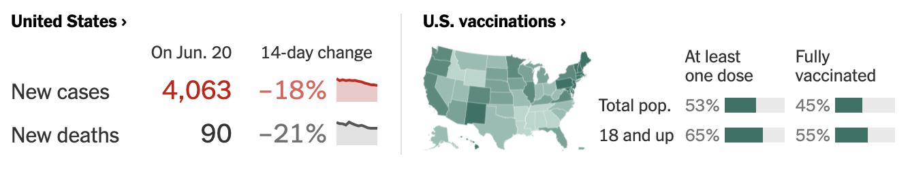
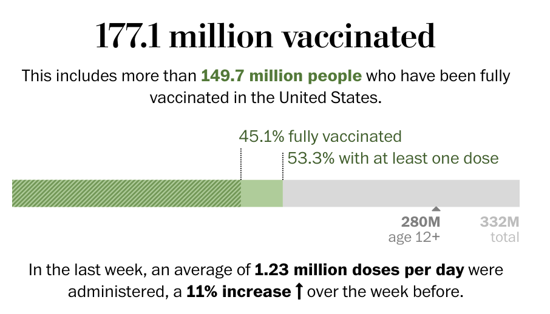
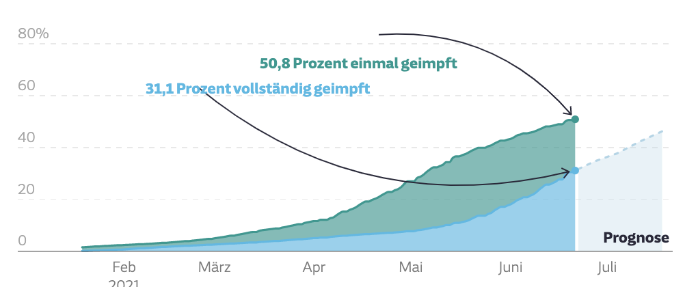
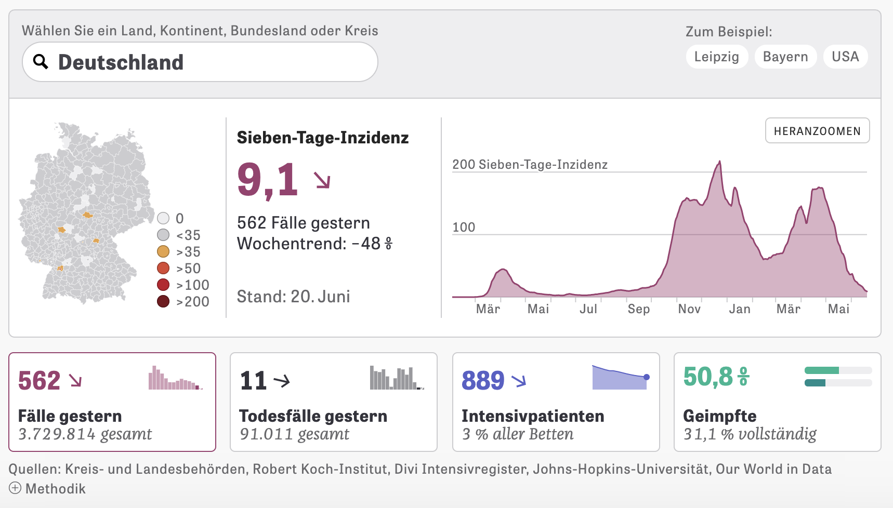
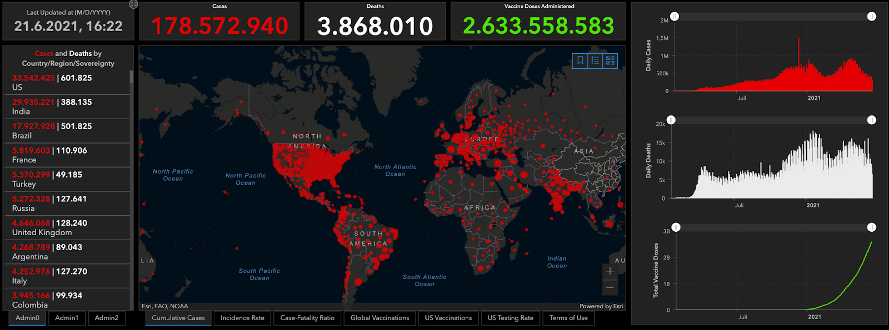
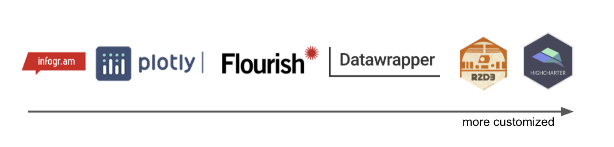
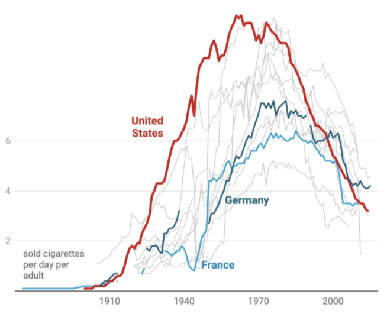
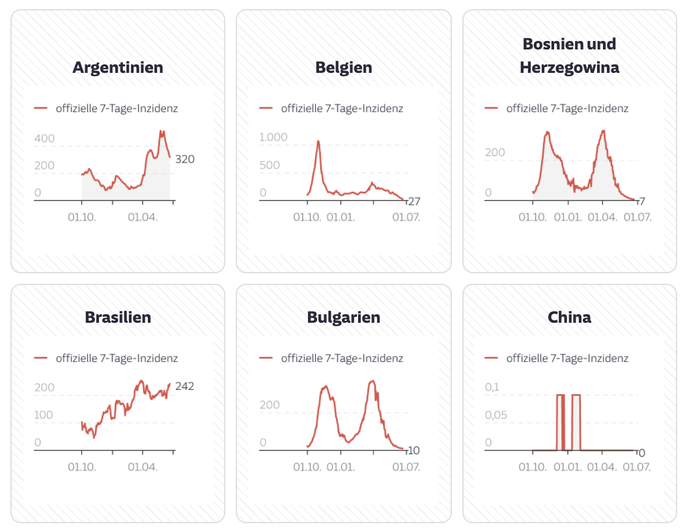

class: hide_logo, middle, center

This presentation is available on:

https://bit.ly/3wOa8jv

---

class: hide_logo

https://docs.google.com/presentation/d/11pluOFKKEodSEGuUQ3uL_9Bh2kS114AGAWWv3XJj_ks/edit#slide=id.p

```{r xaringan-logo, echo=FALSE}
xaringanExtra::use_logo(
  image_url = "img/datawrappr_logo.png"
)
```

# Covid-19...

... sparked a lot of interest in data driven journalism

--

.pull-left[
  .image-100[]
  .image-100[]
  .image-100[]
]

.pull-right[
  .image-100[]
  .image-100[]
]

---

class: hide_logo

# Solutions

.image-100[]

---

class: hide_logo

# Datawrapper

* Startup for creating interactive, hosted charts and maps

* Used by newsrooms, finance and governments around the world

.right-column[
  .image-80.shadow[]
]


---

# DatawRappr

Available at: [Github](https://github.com/munichrocker/DatawRappr)

```{r eval=FALSE, tidy=FALSE}
remotes::install_github("munichrocker/DatawRappr")
```

Created in 2019

Wrapper for Datawrapper’s API

--

Main features:
* `dw_create_chart(title = "My test chart", type = "d3-lines")`
* `dw_data_to_chart(df, chart_id = "ABCD1")`
* `dw_edit_chart(chart_id, title = "I want a new title", intro = "with a great intro")`
* `dw_publish_charts(chart_id)`

---

# DatawRappr

Special features:

* Charts, maps, annotations or tooltips can be automated

* Export function to create small-multiples:

.right-column[
  .image-90[]
]

---

# Next up

Next major release will be v1.2 (coming up in the next weeks): 

* RETRYs, 
* better handling of tsv-data, 
* smarter arguments

Package should be added to CRAN this year for easier access


---

class: center, middle

# Thanks!

You can contact me:

@munichrocker on [Twitter](www.twitter.com/munichrocker) and [Github](https://github.com/munichrocker)

info@benedict-witzenberger.de
